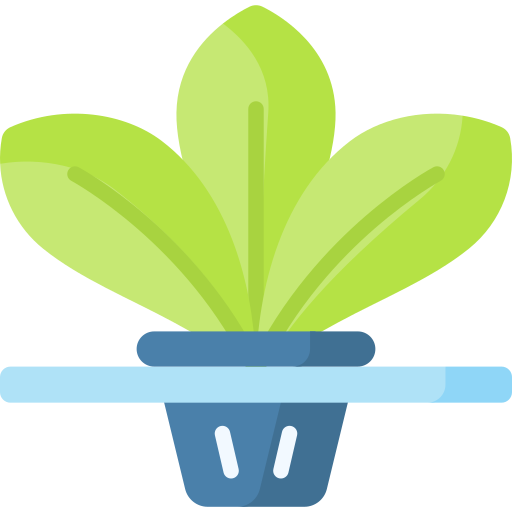
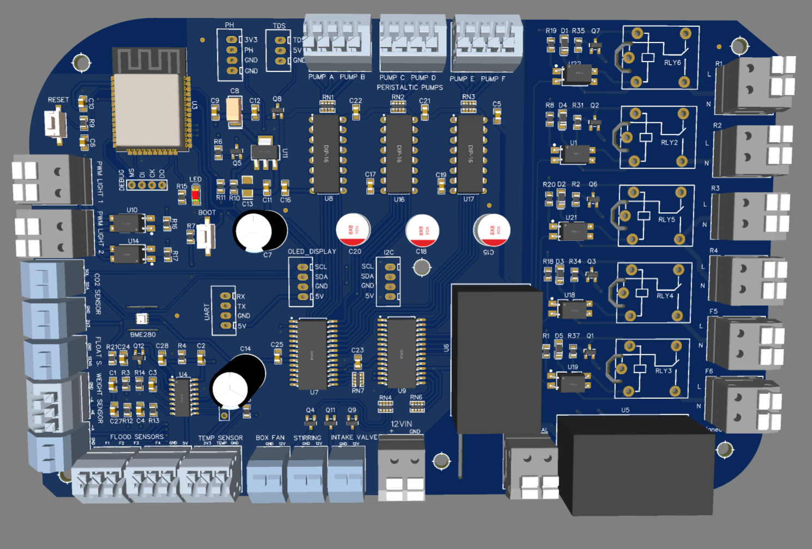
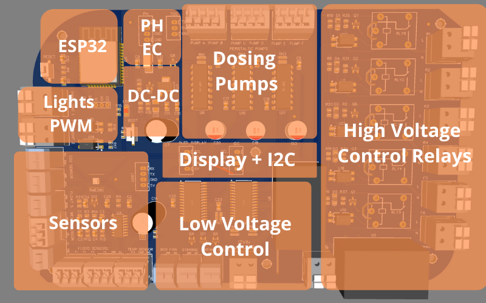
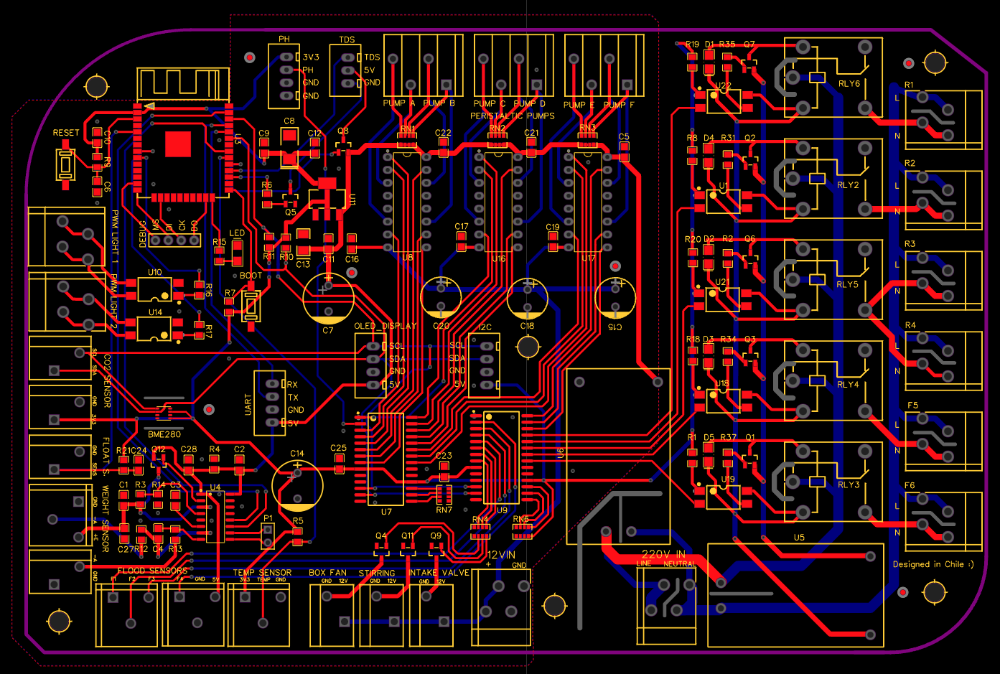
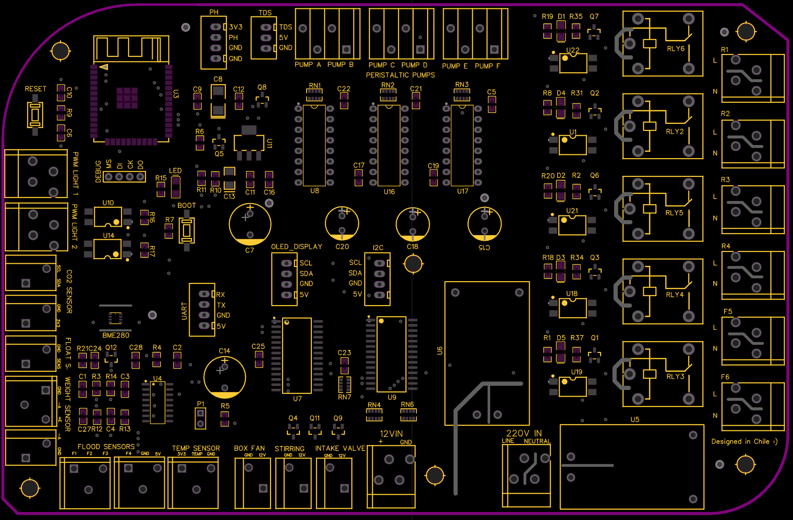
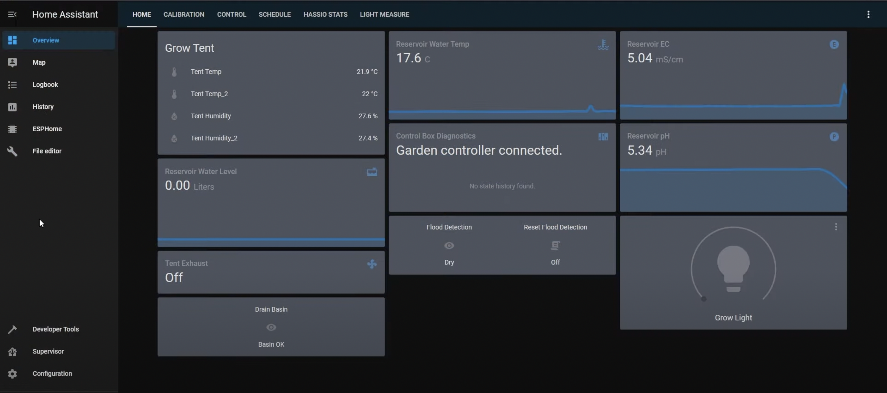
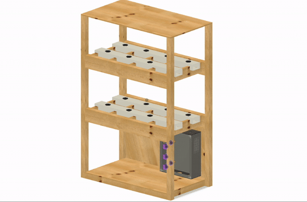
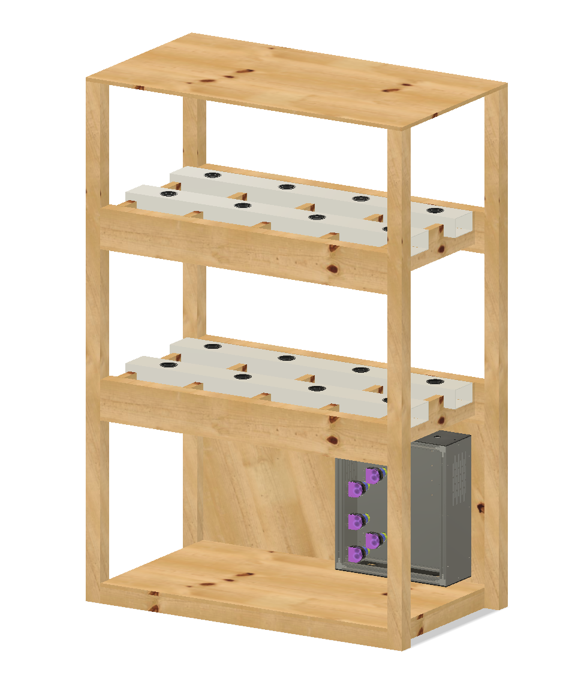

# QiU — Grow Anything.

**An open-source, ESP32-powered PCB to automate and grow whatever you want, wherever you are.**

<a href="#-why-qiu-exists">Why</a> ·
<a href="#-specs">Specs</a> ·
<a href="#-board-gallery">Gallery</a> ·
<a href="#-schematics--design-files">Files</a> ·
<a href="#-make-one">Make One</a> ·
<a href="#-learning-sources--thanks">Learn</a> ·
<a href="https://www.buymeacoffee.com/jnrivera">Donate</a> ·
<a href="https://linkedin.com/in/jnrivra">Contact</a>

 

---

QiU is an open-source solution to automate and grow whatever you want, wherever you are. It is a single, custom-designed printed circuit board that can **sense and control everything a smart-agriculture or hydroponics setup needs** — relays, dosing pumps, lighting, climate, water level, pH, EC and weight — driven by an ESP32 with WiFi + Bluetooth.

The project is built on top of numerous open-source ideas and tutorials from amazing people contributing to a better world. The goal of QiU is to deliver a **complete, professional solution as cheaply as possible** to accelerate the adoption of smart agriculture.

- 🌱 **Sense & control everything** — one board for the whole grow
- 💸 **Cheap, easy-to-find, repairable components** — ~80 USD all-in
- 🔁 **Future proof & open source** — schematics, Gerbers and BOM all public
- 🏭 **One-click ordering** — fabricated and shipped assembled from a single unit

---

## 🌍 Why QiU Exists?

#### TL;DR

There isn't enough food, and climate change + soil erosion will make farming production a nightmare for most of the population.
[National Geographic: The Future of Food](https://www.nationalgeographic.com/foodfeatures/feeding-9-billion/)

#### The long version

* The earth will eventually have to support around 12 billion people. [Wikipedia](https://en.wikipedia.org/wiki/Projections_of_population_growth)
* We have to grow, in the next 30 years, the same amount of food as in the past 10,000 years combined.
* Fertile land is shrinking fast — projected 60% less by 2070. [EU Science Hub](https://ec.europa.eu/jrc/en/news/global-soil-erosion-projected-be-worse-previously-expected)

Smart, affordable automation lets more people grow more food in less space, closer to home. That's what QiU is for.

---

## ⚡ Specs

The brain is an **ESP32-WROOM-32 (WiFi + BLE)**, powered from either mains or a 12 V supply. Around it, QiU integrates high-voltage switching, low-voltage drivers and a full sensor suite on a **2-layer board**.

| Domain | What it does | Hardware |
| --- | --- | --- |
| **Power input** | Dual supply | 100–240 VAC **and** 12 VDC |
| **Processor** | WiFi + Bluetooth control | 1 × [ESP32-WROOM-32](https://lcsc.com/product-detail/WiFi-Modules_Espressif-Systems-ESP32-WROOM-32_C82899.html) |
| **High-voltage control** | Switch mains loads | 7 × [100–220 VAC 10 A relays](https://lcsc.com/product-detail/Power-Relays_Ningbo-Songle-Relay-SRD-05VDC-SL-C_C35449.html) |
| **Dosing pumps** | Nutrient / pH dosing | 6 × [0–12 VDC motor drivers (L293D)](https://www.lcsc.com/product-detail/Motor-Driver-ICs_HGSEMI-L293DN_C434590.html) |
| **Low-voltage control** | Small DC loads | 3 × [0–12 VDC 200 mA, 2N3904](https://www.lcsc.com/product-detail/Transistors-NPN-PNP_KEC_2n3904S-RTK-P_2n3904S-RTK-P_C18536.html) |
| **Light control** | Dimmable grow lights | 2 × [0–10 VDC PWM (PC817 opto)](https://www.lcsc.com/product-detail/Optocouplers-Phototransistor-Output_Sharp-Microelectronics-PC817X2CSP9F_C66405.html) |
| **Climate** | Temperature & humidity | 1 × [BME280](https://lcsc.com/product-detail/Humidity-Sensors-Temperature-and-Humidity-Sensors_Bosch-Sensortec-BME280_C92489.html) |
| **Flood sensing** | Leak / level detection | 4 × [flood sensors](https://www.aliexpress.com/item/32562744759.html) |
| **Weight** | Reservoir / yield scale | 4 × 50 kg load cells + [HX711](https://www.aliexpress.com/item/32786655201.html) |
| **pH** | Nutrient solution pH | 1 × [pH 0–14 sensor](https://www.aliexpress.com/item/1005002973899737.html) |
| **EC / TDS** | Nutrient concentration | 1 × [TDS analog sensor](https://www.aliexpress.com/item/1005003343459012.html) |
| **Display** | Local readout | 1 × [128×64 OLED](https://www.aliexpress.com/item/32957392300.html) |
| **Laser water level** | Contactless distance | up to 3 × [TOF10120 sensors](https://www.aliexpress.com/item/1005003301622057.html) |

 <em>Functional sections of the QiU board.</em>

---

## 🖼 Board Gallery

</img>
</img>
</img>

  

---

## 📐 Schematics & Design Files

QiU was designed in **EasyEDA** (v6.4.25). Everything you need to inspect, modify or fabricate the board lives in this repo:

| File | Description |
| --- | --- |
| [`Images/PCB/Schematic.pdf`](Images/PCB/Schematic.pdf) | Full schematic |
| [`Images/PCB/Board.pdf`](Images/PCB/Board.pdf) | Board layout |
| [`Gerber/`](Gerber) | Production Gerber + drill files |
| 🌐 [EasyEDA project](https://oshwlab.com/project/join/1434277bf96d4e55b25e27bfc97eff9a) | Live, editable source project |

### Gerber package (`Gerber/`)

A complete 2-layer fabrication set:

| Layer | File |
| --- | --- |
| Top copper | `Gerber_TopLayer.GTL` |
| Bottom copper | `Gerber_BottomLayer.GBL` |
| Top solder mask | `Gerber_TopSolderMaskLayer.GTS` |
| Bottom solder mask | `Gerber_BottomSolderMaskLayer.GBS` |
| Top paste (stencil) | `Gerber_TopPasteMaskLayer.GTP` |
| Top silkscreen | `Gerber_TopSilkLayer.GTO` |
| Board outline | `Gerber_BoardOutline.GKO` |
| Plated drill | `Gerber_Drill_PTH.DRL` |

---

## 🏭 Make One

You have two easy paths:

**1. Order assembled from EasyEDA (easiest).**
Open the [EasyEDA project](https://oshwlab.com/project/join/1434277bf96d4e55b25e27bfc97eff9a), click **Fabrication**, and get the board manufactured **with components soldered**, shipped to your door — from a single unit.

**2. Order bare boards from any fab (JLCPCB, PCBWay, OSH Park…).**
Zip the [`Gerber/`](Gerber) folder and upload it to your fab of choice. It is a standard 2-layer board. (See [`Gerber/How-to-order-PCB.txt`](Gerber/How-to-order-PCB.txt) for EasyEDA's ordering guide.)

### 💵 How expensive is QiU?

Price depends on quantity and shipping, but roughly per board:

| Item | Cost |
| --- | --- |
| PCB | ~10 USD |
| Components | ~38.2 USD |
| Shipping | ~30 USD |
| **Total** | **~80 USD** |

> I don't take any commission on sales. If QiU helps you, you can [☕ Buy Me A Coffee](https://www.buymeacoffee.com/jnrivera).

---

## 🖥 UI

The user interface is based on **Home Assistant** (full config coming soon).

 

---

## 🌿 MVP — Apartment Micro-Farm

To test the board, I'm building a hydroponics system for my apartment: a good-looking product made from cheap, easy-to-source materials. The 3D design is a work in progress:

---

## ✅ Status of the Project

- [x] Kick-off, design, requirements (1 Oct)
- [x] PCB design (7 Oct)
- [x] Sent to manufacture (9 Oct)
- [x] Components purchased (10 Oct)

### Short-term to-do

- [x] Manufacture structure
- [ ] Install hydroponics system
- [ ] Install electronics and equipment
- [ ] Testing

### What's next for QiU?

- [ ] After testing, redesign the PCB (adding energy-consumption measurement) and ship a single SD image with Home Assistant pre-installed for a Raspberry Pi.
- [ ] Build an **Edge computing node** so you can run a complete vertical farm with AI / machine learning using ~4 USD cameras. Biofeedback systems are the future.

If you want to start playing now, here's the hardware I'd buy (no Pi 4 in stock anywhere, so these are for a CM4 + expansion):

| Component | Link |
| --- | --- |
| Raspberry Pi Compute Module 4 | [AliExpress](https://www.aliexpress.com/item/1005001848142895.html) |
| RPi CM4 expansion | [AliExpress](https://www.aliexpress.com/item/1005003086145065.html) |
| RPi UPS | [AliExpress](https://www.aliexpress.com/item/33008497003.html) |
| RPi SSD | [AliExpress](https://www.aliexpress.com/item/1005001505371944.html) |
| ESP32-CAM | [AliExpress](https://www.aliexpress.com/item/1005001322358029.html) |

---

## 📚 Learning Sources & Thanks!

This project stands on the shoulders of an incredible open-source community. Huge thanks to:

**Garden automation**
- [Led Gardener — OpenGarden / gardenAutomation](https://github.com/ledgardener/gardenAutomation)

**Hydroponics & gardening**
- [Hoocho](https://www.youtube.com/channel/UC2DFOHCzzuSlS8vyrvMq7Ng) ·
[Simple Greens Hydroponics](https://www.youtube.com/channel/UCaS_KzwSmTVuWvR1xTsllwA) ·
[Epic Gardening](https://www.youtube.com/channel/UCSbyncU597LMwb3HhnAI_4w) ·
[Kyle Gabriel](https://www.youtube.com/channel/UCA4gOP4kv3uYbPybAraDuUw)

**Home Assistant / Node-RED / hardware**
- [Andreas Spiess](https://www.youtube.com/c/AndreasSpiess) ·
[The Hook Up](https://www.youtube.com/channel/UC2gyzKcHbYfqoXA5xbyGXtQ) ·
[Steve Cope](https://www.youtube.com/user/stevecope) ·
[Electronic Clinic](https://www.youtube.com/channel/UCo1jouP-SEy7Pjrk1p-lDaQ)

---

## 📄 License

Released under the **[GNU General Public License v3.0](LICENSE)**. You are free to use, study, share and improve QiU — as long as derivatives stay open under the same license.

 
Made with 🌱 by <a href="https://github.com/jnrivra">Juan Enrique Rivera Olivares</a> ·
<a href="https://linkedin.com/in/jnrivra">LinkedIn</a>

